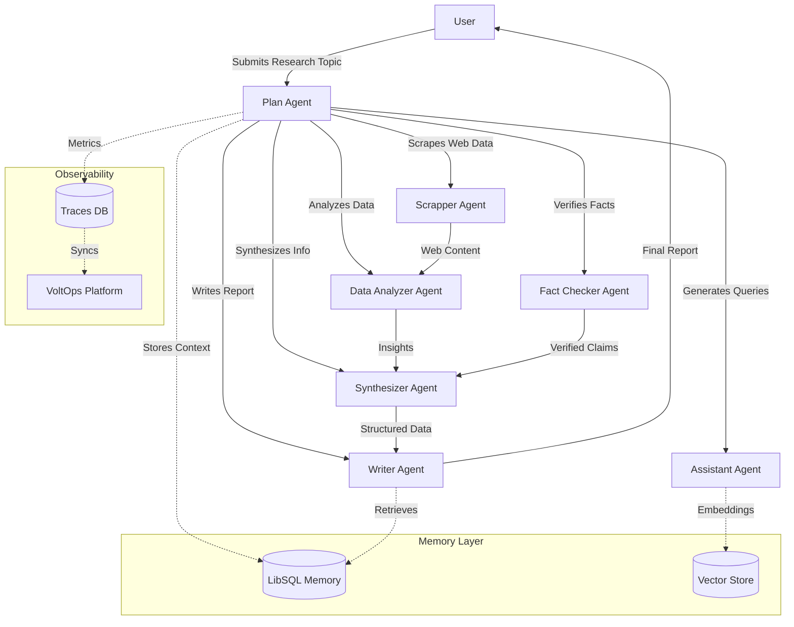
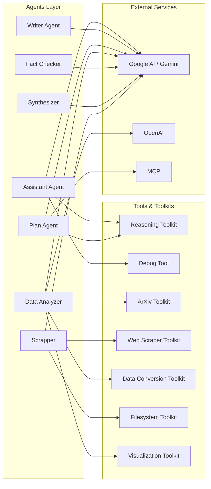

<div align="center">

<a href="https://voltagent.dev/">

</a>

<br/>
<br/>

# 🔋 Mastervolt Deep Research

**Enterprise-grade multi-agent research system powered by VoltAgent**

<br/>

[](https://www.npmjs.com/package/@voltagent/core)
[](https://www.typescriptlang.org/)
[](https://nodejs.org/)
[](https://www.npmjs.com/package/ai)
[](LICENSE)

[](https://www.npmjs.com/package/@ai-sdk/google)
[](https://www.npmjs.com/package/@ai-sdk/openai)
[](https://www.npmjs.com/package/@voltagent/libsql)
[](https://www.npmjs.com/package/vitest)
[](https://www.npmjs.com/package/zod)

[Documentation](https://voltagent.dev/docs/) • [VoltOps Platform](https://console.voltagent.dev) • [Discord](https://s.voltagent.dev/discord) • [Examples](https://github.com/voltagent/voltagent/tree/main/examples)

</div>

<br/>

---

## Overview

Mastervolt Deep Research is a sophisticated multi-agent orchestration system built on VoltAgent that automates complex research workflows. It combines specialized AI agents, semantic memory, intelligent tooling, and custom web scraping to conduct comprehensive research, verify facts, analyze data, and generate publication-ready reports.

### Key Features

- **🤖 Multi-Agent Orchestration** - PlanAgent-supervised coordination of 14+ specialized agents
- **🧠 Semantic Memory** - LibSQL-backed vector storage with Google text embeddings
- **🔍 Custom Web Scraping** - Purpose-built web scraper toolkit for research data collection
- **📊 Data Analysis** - ArXiv integration, data conversion, filesystem operations, and visualization
- **✅ Fact Checking** - Automated verification with custom claim checking and bias detection tools
- **📝 Report Generation** - PhD-level research reports with citations and structured formatting
- **🎨 Rich AI UI System** - Specialized `ai-elements` for visualizing agent thoughts, tool executions, and artifacts
- **👨‍💻 Expanded Agent Suite** - New specialized agents for Coding, Data Science, and Content Curation
- **💬 Interactive Chat Interface** - Built-in Next.js chat interface for real-time agent interaction
- **🔄 A2A Communication** - Agent-to-agent message passing and shared state management
- **📈 Observability** - OpenTelemetry tracing with VoltOps platform integration
- **🎯 Type Safety** - Zod schema validation throughout the workflow chain

## Architecture

### Multi-Agent Workflow



### Tool & Service Integration



## Quick Start

### Prerequisites

- Node.js 18+
- npm, pnpm, or yarn
- Google Generative AI API key (required)
- Supabase account (optional, for A2A task storage)

### Installation

```bash
# Clone the repository
git clone https://github.com/ssdeanx/Mastervolt-Deep-Research.git
cd Mastervolt-Deep-Research

# Install dependencies
npm install

# Set up environment variables
cp .env.example .env
```

### Configuration

Edit `.env` with your API keys:

```bash
GOOGLE_GENERATIVE_AI_API_KEY='your_google_generative_ai_api_key_here'

# Optional: For A2A task storage
# SUPABASE_URL='your_supabase_url_here'
# SUPABASE_KEY='your_supabase_key_here'
```

### Running the System

```bash
# Development mode with auto-reload (Agents)
npm run dev

# Start Next.js UI (Chat Interface)
npm run next

# Build for production
npm run build

# Start production server
npm start
```

### Interacting with Agents

You can interact with the agents through the built-in Chat Interface:

1. Start the Next.js application: `npm run next`
2. Open [http://localhost:3000](http://localhost:3000) in your browser
3. Use the chat interface to submit research topics

Alternatively, use the [VoltOps Platform](https://console.voltagent.dev) for workflow management.

## Agent Capabilities

### Plan Agent (Deep Research Agent)

**Purpose**: Orchestrates the entire research workflow and coordinates all specialized agents. Replaces the previous Director Agent.

**Tools**:

- Reasoning Toolkit (think-only mode)
- Filesystem Toolkit (ls, read, write, edit, grep)

**Key Features**:

- Supervises 6+ sub-agents
- Custom handoff guidelines for workflow optimization
- Full stream event forwarding for real-time monitoring
- Manages research tasks and subtasks

### Coding Agent

**Purpose**: Implements code features, fixes bugs, and refactors code with a focus on TypeScript and VoltAgent patterns.

**Tools**:

- `code_analysis_toolkit` - Structural analysis of codebase
- `filesystem_toolkit` - File operations
- `git_toolkit` - Version control operations
- `test_toolkit` - Test execution and validation

**Key Features**:

- Low temperature (0.2) for precision
- Specialized prompts for implementation tasks
- Lifecycle hooks for operation tracking

### Data Scientist Agent

**Purpose**: Performs statistical analysis, exploratory data analysis (EDA), and generates data-driven hypotheses.

**Tools**:

- `data_processing_toolkit` - Data cleaning, normalization, and aggregation
- `think_only_toolkit` - Reasoning capabilities

**Key Features**:

- Dynamic model selection (Flash vs. Preview) based on complexity
- Statistical methodology enforcement (p-values, effect sizes)
- Automated data quality assessment

### Assistant Agent

**Purpose**: Generates effective search queries and coordinates research strategy

**Tools**:

- `get_weather` - Example custom tool for weather queries
- Reasoning Toolkit (think-only mode)
- Debug Tool - Context inspection and logging

**Key Features**:

- Query optimization for comprehensive research coverage
- Integration with semantic memory for context-aware queries
- Customizable search strategies via prompt parameters

### Scrapper Agent

**Purpose**: Extracts and collects data from web sources using custom web scraper toolkit

**Tools**: Web Scraper Toolkit with:

- `scrape_webpage_markdown` - Full webpage conversion to clean Markdown
- `extract_code_blocks` - Code extraction with surrounding context
- `extract_structured_data` - Headings, links, tables, lists, metadata
- `extract_text_content` - Clean text extraction
- `batch_scrape_pages` - Recursive batch scraping with depth control

**Key Features**:

- Respects robots.txt and rate limiting
- Graceful error handling with retry logic
- Configurable depth for link following
- Pattern-based URL filtering (include/exclude)
- Markdown output with embedded code blocks

### Data Analyzer Agent

**Purpose**: Analyzes research data, extracts patterns, and generates data-driven insights

**Tools**:

- `analyze_data_patterns` - Pattern, trend, correlation, and anomaly detection
- `extract_key_insights` - Insight extraction with focus areas
- Reasoning Toolkit (think-only mode)
- ArXiv Toolkit:
    - `arxiv_search` - Academic paper search via arXiv API
    - `arxiv_pdf_extract` - PDF text extraction with page limits

**Key Features**:

- Multi-type analysis (patterns, trends, correlations, anomalies)
- Focus-specific insight generation
- Data quality assessment and recommendations
- Lower temperature (0.3) for consistent analysis

### Fact Checker Agent

**Purpose**: Verifies information accuracy, detects bias, and ensures research integrity

**Tools**:

- `verify_claim` - Claim verification with confidence scoring
- `cross_reference_sources` - Multi-source consistency analysis
- `detect_bias` - Bias detection with credibility scoring
- Reasoning Toolkit (think-only mode)

**Key Features**:

- Multi-level confidence ratings (High/Medium/Low)
- Source cross-referencing for consensus detection
- Content-type specific bias analysis (academic, article, report, social media)
- Credibility scoring (0-100 scale)
- Very low temperature (0.2) for factual consistency

### Synthesizer Agent

**Purpose**: Combines multiple research streams, resolves contradictions, creates unified narratives

**Tools**:

- `synthesize_information` - Multi-source integration with theme extraction
- `resolve_contradictions` - Contradiction identification and resolution
- `create_unified_narrative` - Coherent narrative construction
- Reasoning Toolkit (think-only mode)

**Key Features**:

- Thematic integration across sources
- Evidence-based contradiction resolution
- Gap identification and recommendations
- Moderate temperature (0.4) for creative synthesis

### Writer Agent

**Purpose**: Composes comprehensive research reports with citations and structured formatting

**Tools**: None (focused on pure writing and synthesis)

**Key Features**:

- PhD-level academic writing capability
- Quality levels from elementary (10%) to expert (100%)
- Markdown formatting with proper structure
- Citation management with footnote notation
- Tone and style customization
- Comprehensive instructions for research report standards

## Project Structure

```bash
src/
├── app/                  # Next.js App Router (UI)
│   ├── api/              # API Routes (Chat, Health, Messages)
│   ├── dashboard/        # User Dashboard & Protected Routes
│   ├── documentation/    # Project Documentation
│   └── ...               # Feature pages (About, Pricing, Features)
├── components/           # React Components
│   ├── ai-elements/      # AI UI System (Conversation, Tools, Artifacts)
│   ├── ui/               # Design System (Shadcn/Radix primitives)
│   └── chat-interface.tsx # Main Chat Interface
├── lib/                  # Shared Utilities
│   ├── resumable-stream.ts # Resumable stream adapters
│   └── utils.ts          # Common helpers
├── voltagent/            # Multi-agent system (Backend)
│   ├── index.ts          # VoltAgent initialization
│   ├── agents/           # 14+ Specialized Agents
│   │   ├── plan.agent.ts          # Deep Research Orchestrator
│   │   ├── coding.agent.ts        # Coding & Implementation
│   │   ├── data-scientist.agent.ts # Data Analysis & Modeling
│   │   ├── judge.agent.ts         # Quality Evaluation
│   │   └── ... (assistant, writer, scrapper, etc.)
│   ├── config/           # Configuration
│   │   ├── mcp.ts           # MCP Client Config
│   │   ├── observability.ts # OpenTelemetry Setup
│   │   └── ...
│   ├── tools/            # 15+ Domain Toolkits
│   │   ├── web-scraper-toolkit.ts
│   │   ├── knowledge-graph-toolkit.ts
│   │   ├── code-analysis-toolkit.ts
│   │   └── ...
│   ├── workflows/        # Workflow Chains
│   └── experiments/      # Live Evals & Regression Tests
```

## Development

### Testing

```bash
# Run all tests
npm test

# Run tests with coverage
npm run test -- --coverage

# Run specific test pattern
npm run test -- -t "agent"
```

### Linting & Formatting

```bash
# Lint code
npm run lint
```

### Evaluation

```bash
# Run evaluations
npm run eval
```

## Key Technologies

| Technology          | Version | Purpose                              |
| ------------------- | ------- | ------------------------------------ |
| **VoltAgent Core**  | ^2.1.5  | Multi-agent orchestration framework  |
| **TypeScript**      | 5.9.3   | Type-safe language with strict mode  |
| **AI SDK**          | ^6.0.42 | Multi-model AI provider abstraction  |
| **Google AI SDK**   | ^3.0.10 | Gemini model integration (primary)   |
| **OpenAI SDK**      | ^3.0.12 | GPT model integration (optional)     |
| **LibSQL**          | ^2.0.2  | SQLite-based memory & vector storage |
| **Zod**             | 4.1.13  | Runtime schema validation            |
| **Vitest**          | 4.0.17  | Testing framework                    |
| **OpenTelemetry**   | 0.210.0 | Observability & tracing              |
| **Cheerio**         | 1.1.2   | HTML parsing for web scraping        |
| **JSDOM**           | 27.4.0  | DOM simulation                       |
| **Turndown**        | 7.2.2   | HTML to Markdown conversion          |
| **fast-xml-parser** | 5.3.3   | XML parsing and building             |
| **Next.js**         | 16.1.4  | React Framework for UI               |
| **React**           | 19.2.3  | UI Library                           |

## Advanced Features

### Semantic Memory

Each agent maintains persistent memory with semantic search capabilities:

- **Working Memory**: User-scoped context with Zod schemas
- **Vector Storage**: LibSQL-backed embedding storage
- **Semantic Retrieval**: Google text-embedding-004 for similarity search
- **Caching**: Embedding cache for performance optimization (1000 entries, 1 hour TTL)

### A2A Communication

Agents communicate via the A2A (Agent-to-Agent) protocol:

- Message passing between agents
- Shared state management via Supabase task store
- Event broadcasting
- Request/response patterns
- Task persistence and retrieval

### Observability

Full tracing and monitoring via OpenTelemetry:

- Automatic trace collection
- VoltOps platform integration
- LibSQL observability adapter
- Sampling strategies (50% ratio-based)
- Batch export to cloud (512 events per batch, 4-second intervals)

### Workflow Chaining

Type-safe workflow composition with Zod schemas:

```typescript
const workflow = createWorkflowChain({
    id: 'research-assistant',
    name: 'Research Assistant Workflow',
    purpose: 'Comprehensive research automation',
    input: z.object({ topic: z.string() }),
    result: z.object({ text: z.string() }),
})
    .andThen({
        id: 'research',
        execute: async ({ data }) => {
            /* ... */
        },
    })
    .andThen({
        id: 'writing',
        execute: async ({ data, getStepData }) => {
            /* ... */
        },
    })
```

### Custom Tools Overview

#### Web Scraper Toolkit (5 tools)

- **Lightweight Stack**: Uses JSDOM, Cheerio, and Turndown (no headless browser required)
- Full webpage to Markdown conversion
- Code block extraction with context
- Structured data extraction (headings, links, tables, lists)
- Clean text extraction
- Batch scraping with recursive link following

#### Data Processing Toolkit (6 tools)

- **normalize_data**: Flatten nested structures
- **detect_format**: Auto-detect JSON/CSV/XML/YAML
- **convert_format**: Format conversion
- **validate_schema**: Schema validation with error reporting
- **aggregate_data**: Grouping and statistics
- **clean_data**: Handling missing values and duplicates

#### Code Analysis Toolkit

- TypeScript structural analysis (via `ts-morph`)
- Python code analysis
- Symbol extraction and reference finding

#### Knowledge Graph Toolkit

- Graph creation and management
- Relationship mapping
- Centrality and community detection analysis

#### Data Analysis Tools (2 tools)

- Pattern/trend/correlation/anomaly analysis
- Key insight extraction with focus areas

#### Fact Checking Tools (3 tools)

- Claim verification with confidence levels
- Cross-reference analysis for consensus
- Bias detection with credibility scoring

#### Synthesis Tools (3 tools)

- Multi-source information synthesis
- Contradiction resolution with multiple strategies
- Unified narrative creation

#### ArXiv Toolkit (2 tools)

- Academic paper search via arXiv API
- PDF text extraction with page limits

#### Data Conversion Toolkit (4 tools)

- CSV to JSON conversion
- JSON to CSV conversion
- XML parsing
- XML building

#### Filesystem Toolkit (3 tools)

- Glob pattern file finding
- Batch file reading
- File statistics and metadata

#### Visualization Toolkit (4 tools)

- Excalidraw to SVG conversion
- SVG to JSON conversion
- JSON to SVG conversion
- SVG optimization

## Use Cases

- **Academic Research**: Literature review automation, citation management, arXiv integration
- **Market Intelligence**: Competitive analysis, trend identification via web scraping
- **Technical Documentation**: API documentation generation, knowledge base creation
- **Investigative Journalism**: Fact-checking with bias detection, source verification, report compilation
- **Due Diligence**: Company research, risk assessment, compliance verification

## Resources

- **VoltAgent Documentation**: [voltagent.dev/docs](https://voltagent.dev/docs/)
- **VoltOps Platform**: [console.voltagent.dev](https://console.voltagent.dev)
- **Discord Community**: [s.voltagent.dev/discord](https://s.voltagent.dev/discord)
- **Blog**: [voltagent.dev/blog](https://voltagent.dev/blog/)

## Acknowledgments

Built with [VoltAgent](https://voltagent.dev/) - the open-source TypeScript framework for building and orchestrating AI agents.

---

<div align="center">

**[⚡ Powered by VoltAgent](https://voltagent.dev/)**

</div>
