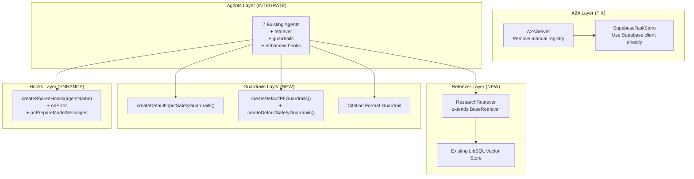

# Design: Gap-improve (REVISED)

## Overview & Goals

Fix critical gaps in the Mastervolt Deep Research system based on **verified** VoltAgent v1.1.30+ documentation and examples. This revision corrects errors in the original design.

**Primary Goals:**

1. Fix broken A2A TaskStore implementation (Critical)
2. Remove unnecessary A2A registry wrapper
3. Implement ResearchRetriever using BaseRetriever pattern
4. Add VoltAgent built-in guardrails to all agents
5. Complete hook coverage with onError, onPrepareModelMessages

## Architecture



## Tech Stack & Decisions

| Component | Technology | Rationale |
|-----------|------------|-----------|
| **A2A Task Store** | `@supabase/supabase-js` direct | SupabaseMemoryAdapter is for Memory, not TaskStore |
| **Retriever** | `BaseRetriever` from `@voltagent/core` | Official pattern from docs |
| **Input Guardrails** | `createDefaultInputSafetyGuardrails()` | Built-in factory includes profanity, PII, injection, HTML |
| **Output Guardrails** | `createDefaultPIIGuardrails()` + custom | Built-in factories + custom citation guardrail |
| **Hooks** | Factory pattern | Consistent across all agents |
| **Vector Search** | Existing LibSQL vector adapter | Already configured with embeddings |

**Key Decisions:**

1. Use VoltAgent built-in guardrail factories instead of custom implementations
2. No manual A2A registry - VoltAgent handles this automatically
3. Single `ResearchRetriever` class shared across research agents
4. Shared hook factory for consistency
5. No new agents in this phase - focus on fixing core issues

## Component Designs

### 1. SupabaseTaskStore (FIX)

**Problem:** Current implementation uses `SupabaseMemoryAdapter` which has no `get()`/`set()` methods.

**Solution:** Use Supabase client directly.

```typescript
// src/a2a/store.ts - CORRECTED
import { createClient } from "@supabase/supabase-js";
import type { TaskRecord, TaskStore } from "@voltagent/a2a-server";

export class SupabaseTaskStore implements TaskStore {
  private supabase = createClient(
    process.env.SUPABASE_URL!,
    process.env.SUPABASE_KEY!
  );

  async load({ agentId, taskId }: { agentId: string; taskId: string }): Promise<TaskRecord | null> {
    const { data, error } = await this.supabase
      .from("a2a_tasks")
      .select("*")
      .eq("agent_id", agentId)
      .eq("task_id", taskId)
      .single();

    if (error || !data) return null;
    return {
      id: data.task_id,
      status: data.status,
      createdAt: new Date(data.created_at),
      updatedAt: new Date(data.updated_at),
      ...data.data,
    } as TaskRecord;
  }

  async save({ agentId, data }: { agentId: string; data: TaskRecord }): Promise<void> {
    await this.supabase.from("a2a_tasks").upsert({
      agent_id: agentId,
      task_id: data.id,
      status: data.status,
      created_at: data.createdAt?.toISOString(),
      updated_at: new Date().toISOString(),
      data: data,
    }, { onConflict: "agent_id,task_id" });
  }
}
```

### 2. A2A Server Cleanup

**Problem:** Manual registry wrapper is unnecessary.

**Solution:** Remove and use VoltAgent auto-registration.

```typescript
// src/a2a/server.ts - CORRECTED
import { A2AServer } from "@voltagent/a2a-server";
import { VoltAgent } from "@voltagent/core";
import { honoServer } from "@voltagent/server-hono";
import { assistantAgent } from "../agents/assistant.agent.js";
import { SupabaseTaskStore } from "./store.js";

export const a2aServer = new A2AServer({
  name: "mastervolt-research",
  version: "0.1.0",
  description: "Mastervolt Deep Research A2A Server",
  // Optional: filter which agents are exposed
  // filterAgents: ({ items }) => items.filter(a => !a.id.includes("internal")),
});

export const voltAgent = new VoltAgent({
  agents: { assistantAgent },
  a2aServers: { a2aServer },
  server: honoServer({ port: 3141 }),
});

// Initialize with custom task store (optional)
a2aServer.initialize({
  taskStore: new SupabaseTaskStore(),
});
```

### 3. Research Retriever

**Pattern:** From `with-retrieval` example and `rag/custom-retrievers.md`

```typescript
// src/retriever/research.retriever.ts
import { BaseRetriever, type BaseMessage, type RetrieveOptions } from "@voltagent/core";
import { LibSQLVectorAdapter } from "@voltagent/libsql";

export class ResearchRetriever extends BaseRetriever {
  private vectorStore: LibSQLVectorAdapter;

  constructor() {
    super({
      toolName: "search_research_memory",
      toolDescription: "Search through previous research findings, papers, and verified facts",
    });
    this.vectorStore = new LibSQLVectorAdapter({
      url: "file:./.voltagent/memory.db",
    });
  }

  async retrieve(input: string | BaseMessage[], options: RetrieveOptions): Promise<string> {
    const searchText = this.extractSearchText(input);
    
    try {
      const results = await this.searchVectorStore(searchText, options);
      
      // Track sources in context
      if (options.context && results.length > 0) {
        options.context.set("sources", results.map(r => ({
          id: r.id,
          score: r.score,
          source: r.metadata?.source,
        })));
      }

      if (results.length === 0) {
        return "No relevant research context found for this query.";
      }

      return results
        .map(r => `Source: ${r.metadata?.source || "research-memory"}\n${r.content}`)
        .join("\n\n---\n\n");
    } catch (error) {
      options.logger?.warn("Retriever search failed", { error });
      return "Research context temporarily unavailable.";
    }
  }

  private extractSearchText(input: string | BaseMessage[]): string {
    if (typeof input === "string") return input;
    if (!Array.isArray(input) || input.length === 0) return "";
    
    const lastMessage = input[input.length - 1];
    if (Array.isArray(lastMessage.content)) {
      return lastMessage.content
        .filter((part: any) => part.type === "text")
        .map((part: any) => part.text)
        .join(" ");
    }
    return String(lastMessage.content || "");
  }

  private async searchVectorStore(query: string, options: RetrieveOptions) {
    // Use existing vector store search
    // Implementation depends on LibSQLVectorAdapter's API
    return [];
  }
}

// Export singleton
export const researchRetriever = new ResearchRetriever();
```

### 4. Guardrails Setup

**Pattern:** From `with-guardrails` example and `guardrails/built-in.md`

```typescript
// src/guardrails/index.ts
import {
  createDefaultInputSafetyGuardrails,
  createDefaultPIIGuardrails,
  createDefaultSafetyGuardrails,
  createOutputGuardrail,
} from "@voltagent/core";

// Input: blocks profanity, PII input, prompt injection, sanitizes HTML
export const inputGuardrails = createDefaultInputSafetyGuardrails();

// Output: redacts numbers 4+ digits, emails, phones
export const piiGuardrails = createDefaultPIIGuardrails();

// Output: profanity filter + max length
export const safetyGuardrails = createDefaultSafetyGuardrails({
  profanity: { mode: "redact", replacement: "[censored]" },
  maxLength: { maxCharacters: 50000 },
});

// Custom: Citation format validation
export const citationGuardrail = createOutputGuardrail({
  id: "citation-format",
  name: "Citation Format Validator",
  description: "Validates and tracks citation format [#]",
  
  handler: async ({ output, originalOutput }) => {
    if (typeof output !== "string") return { pass: true };
    
    const citationPattern = /\[\d+\]/g;
    const citations = output.match(citationPattern) || [];
    
    return {
      pass: true,
      metadata: {
        citationCount: citations.length,
        hasCitations: citations.length > 0,
        originalLength: originalOutput?.length,
        outputLength: output.length,
      },
    };
  },
});

// Combined export for agents
export const outputGuardrails = [
  ...piiGuardrails,
  ...safetyGuardrails,
  citationGuardrail,
];
```

### 5. Shared Hooks Factory

**Pattern:** From `with-hooks` example and `agents/hooks.md`

```typescript
// src/hooks/shared.hooks.ts
import { createHooks, messageHelpers } from "@voltagent/core";
import { voltlogger } from "../config/logger.js";

export function createSharedHooks(agentName: string) {
  return createHooks({
    onStart: async ({ agent, context }) => {
      const opId = crypto.randomUUID().slice(0, 8);
      context.context.set("opId", opId);
      voltlogger.info(`[${opId}] ${agent.name} starting`);
    },

    onEnd: async ({ agent, output, error, context }) => {
      const opId = context.context.get("opId");
      if (error) {
        voltlogger.error(`[${opId}] ${agent.name} error: ${error.message}`);
      } else {
        voltlogger.info(`[${opId}] ${agent.name} completed`);
      }
    },

    onError: async ({ agent, error, context }) => {
      const opId = context.context.get("opId");
      voltlogger.error(`[${opId}] ${agent.name} error`, {
        message: error.message,
        stack: error.stack,
        userId: context.userId,
        conversationId: context.conversationId,
      });
    },

    onToolStart: async ({ tool, context }) => {
      const opId = context.context.get("opId");
      voltlogger.info(`[${opId}] tool: ${tool.name}`);
    },

    onToolEnd: async ({ tool, error, context }) => {
      const opId = context.context.get("opId");
      if (error) {
        voltlogger.error(`[${opId}] tool ${tool.name} failed: ${error.message}`);
      }
    },

    onPrepareMessages: async ({ messages }) => {
      const timestamp = new Date().toISOString();
      const enhanced = messages.map(msg => 
        messageHelpers.addTimestampToMessage(msg, timestamp)
      );
      return { messages: enhanced };
    },

    onPrepareModelMessages: async ({ modelMessages }) => {
      // Inject research guidelines if no system message
      if (!modelMessages.some(msg => msg.role === "system")) {
        return {
          modelMessages: [
            {
              role: "system",
              content: [{ type: "text", text: "Follow research integrity guidelines." }],
            },
            ...modelMessages,
          ],
        };
      }
      return {};
    },

    onHandoff: async ({ agent, sourceAgent }) => {
      voltlogger.info(`Handoff: ${sourceAgent.name} → ${agent.name}`);
    },
  });
}
```

## File Structure

```bash
src/
├── a2a/
│   ├── server.ts          # MODIFY: Remove manual registry
│   └── store.ts           # REPLACE: Use Supabase client directly
├── retriever/
│   ├── research.retriever.ts  # NEW: BaseRetriever implementation
│   └── index.ts               # NEW: Export retriever
├── guardrails/
│   └── index.ts               # NEW: Built-in + custom guardrails
├── hooks/
│   └── shared.hooks.ts        # NEW: Shared hook factory
└── agents/
    ├── assistant.agent.ts     # MODIFY: Add retriever, guardrails, hooks
    ├── data-analyzer.agent.ts # MODIFY: Add retriever, guardrails, hooks
    ├── fact-checker.agent.ts  # MODIFY: Add retriever, guardrails, hooks
    ├── synthesizer.agent.ts   # MODIFY: Add retriever, guardrails, hooks
    ├── writer.agent.ts        # MODIFY: Add guardrails, hooks
    ├── scrapper.agent.ts      # MODIFY: Add guardrails, hooks
    └── director.agent.ts      # MODIFY: Add guardrails, hooks
```

## Agent Integration Pattern

```typescript
// Example: src/agents/assistant.agent.ts - MODIFIED
import { Agent, Memory, AiSdkEmbeddingAdapter } from "@voltagent/core";
import { google } from "@ai-sdk/google";
import { LibSQLMemoryAdapter, LibSQLVectorAdapter } from "@voltagent/libsql";
import { researchRetriever } from "../retriever/index.js";
import { inputGuardrails, outputGuardrails } from "../guardrails/index.js";
import { createSharedHooks } from "../hooks/shared.hooks.js";
import { voltObservability } from "../config/observability.js";

export const assistantAgent = new Agent({
  id: "assistant",
  name: "Assistant",
  // ... existing config ...
  
  // NEW: Add retriever
  retriever: researchRetriever,
  
  // NEW: Add guardrails
  inputGuardrails,
  outputGuardrails,
  
  // REPLACE: Use shared hooks
  hooks: createSharedHooks("assistant"),
  
  // ... rest of config ...
});
```

## Database Schema (Supabase)

```sql
-- Required table for A2A TaskStore
CREATE TABLE IF NOT EXISTS a2a_tasks (
  id UUID PRIMARY KEY DEFAULT gen_random_uuid(),
  agent_id TEXT NOT NULL,
  task_id TEXT NOT NULL,
  status TEXT NOT NULL DEFAULT 'pending',
  created_at TIMESTAMPTZ DEFAULT NOW(),
  updated_at TIMESTAMPTZ DEFAULT NOW(),
  data JSONB,
  UNIQUE(agent_id, task_id)
);

-- Index for fast lookups
CREATE INDEX idx_a2a_tasks_agent_task ON a2a_tasks(agent_id, task_id);
```

## Non-functional Requirements

| Requirement | Metric | Acceptance |
|-------------|--------|------------|
| **A2A Fixes** | No runtime errors | `npm run dev` succeeds |
| **Guardrails** | <50ms execution | P95 latency |
| **Retriever** | <500ms latency | P95 for vector search |
| **Compatibility** | Zero breaking changes | All existing tests pass |
| **Test Coverage** | >80% for new code | `npm test` reports |

## Testing Strategy

| Component | Tests |
|-----------|-------|
| SupabaseTaskStore | Unit: load/save CRUD |
| ResearchRetriever | Unit: extract text, format results |
| Guardrails | Unit: PII patterns, edge cases |
| Hooks | Unit: hook execution, error handling |
| Integration | E2E: Agent with retriever + guardrails |

## Migration Plan

1. **Phase 1**: Fix A2A (no downtime)
   - Create Supabase table
   - Replace store.ts
   - Clean server.ts

2. **Phase 2**: Add retriever + guardrails
   - Create new files
   - Integrate with 4 research agents

3. **Phase 3**: Complete integration
   - Add guardrails to remaining agents
   - Add shared hooks to all agents

**Rollback:** Revert file changes, drop Supabase table

---

**Status:** REVISED - READY FOR APPROVAL  
**Dependencies:** PRD approved (revised)  
**Estimated Effort:** 2-3 days
