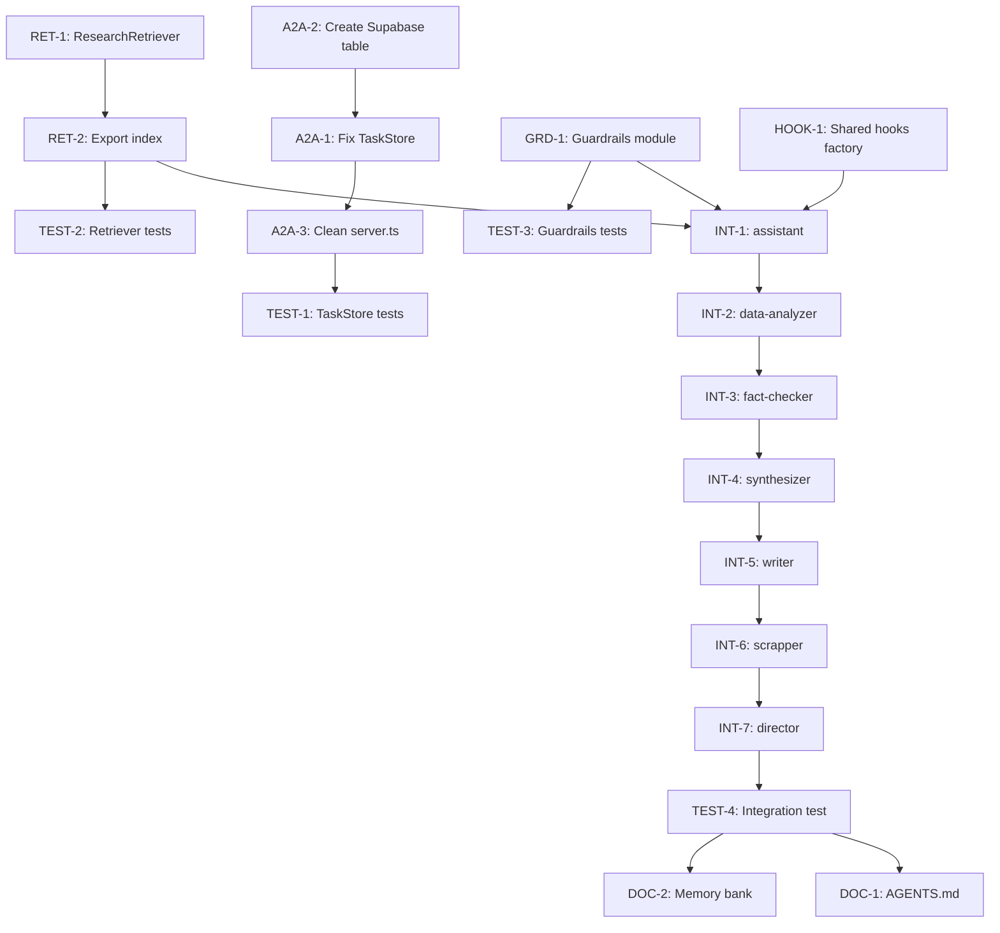

# Tasks: Gap-improve (REVISED)

## Task Breakdown

Based on **verified** VoltAgent v1.1.30+ documentation and corrected gap analysis.

### Critical Fixes (Must Do First)

| ID | Title | Description | Acceptance Criteria | Effort | Dependencies |
|----|-------|-------------|---------------------|--------|--------------|
| **A2A-1** | Fix SupabaseTaskStore | Replace broken SupabaseMemoryAdapter with direct Supabase client | - Uses `createClient()` directly - `load()` queries `a2a_tasks` table - `save()` upserts correctly - No `(as any)` casts | M | Supabase table created |
| **A2A-2** | Create Supabase table schema | Document/create `a2a_tasks` table | - Table exists in Supabase - Schema matches design doc | XS | None |
| **A2A-3** | Clean A2A server.ts | Remove manual `agentRegistry` wrapper | - No `a2aServer.initialize({ agentRegistry: ... })` - VoltAgent auto-registers agents | XS | A2A-1 |

### New Components

| ID | Title | Description | Acceptance Criteria | Effort | Dependencies |
|----|-------|-------------|---------------------|--------|--------------|
| **RET-1** | Create ResearchRetriever | Implement `BaseRetriever` for research context | - Extends `BaseRetriever` - `retrieve()` returns formatted context - Tracks sources in context - Error handling with fallback | M | None |
| **RET-2** | Export retriever from index.ts | Create `src/retriever/index.ts` | - Exports `researchRetriever` singleton - Type exports included | XS | RET-1 |
| **GRD-1** | Create guardrails module | Use VoltAgent built-in factories + custom | - `createDefaultInputSafetyGuardrails()` - `createDefaultPIIGuardrails()` - `createDefaultSafetyGuardrails()` - Custom citation guardrail | S | None |
| **HOOK-1** | Create shared hooks factory | `createSharedHooks(agentName)` function | - All 8 hook types - Includes `onError` - Includes `onPrepareModelMessages` - Consistent logging | M | None |

### Agent Integration

| ID | Title | Description | Acceptance Criteria | Effort | Dependencies |
|----|-------|-------------|---------------------|--------|--------------|
| **INT-1** | Integrate assistant.agent.ts | Add retriever, guardrails, hooks | - `retriever: researchRetriever` - `inputGuardrails` - `outputGuardrails` - `hooks: createSharedHooks("assistant")` | S | RET-1, GRD-1, HOOK-1 |
| **INT-2** | Integrate data-analyzer.agent.ts | Add retriever, guardrails, hooks | Same as INT-1 | S | RET-1, GRD-1, HOOK-1 |
| **INT-3** | Integrate fact-checker.agent.ts | Add retriever, guardrails, hooks | Same as INT-1 | S | RET-1, GRD-1, HOOK-1 |
| **INT-4** | Integrate synthesizer.agent.ts | Add retriever, guardrails, hooks | Same as INT-1 | S | RET-1, GRD-1, HOOK-1 |
| **INT-5** | Integrate writer.agent.ts | Add guardrails, hooks (no retriever) | - `inputGuardrails` - `outputGuardrails` - `hooks: createSharedHooks("writer")` | S | GRD-1, HOOK-1 |
| **INT-6** | Integrate scrapper.agent.ts | Add guardrails, hooks (no retriever) | Same as INT-5 | S | GRD-1, HOOK-1 |
| **INT-7** | Integrate director.agent.ts | Add guardrails, hooks (no retriever) | Same as INT-5 | S | GRD-1, HOOK-1 |

### Testing & Documentation

| ID | Title | Description | Acceptance Criteria | Effort | Dependencies |
|----|-------|-------------|---------------------|--------|--------------|
| **TEST-1** | Unit tests for TaskStore | Test load/save with mocked Supabase | - CRUD operations tested - Error cases covered | S | A2A-1 |
| **TEST-2** | Unit tests for Retriever | Test retrieve method | - Text extraction tested - Formatting tested - Error fallback tested | S | RET-1 |
| **TEST-3** | Unit tests for Guardrails | Test built-in + custom | - PII patterns verified - Citation format validated | S | GRD-1 |
| **TEST-4** | Integration test | E2E agent with all components | - Agent responds correctly - Guardrails execute - Hooks log properly | M | All INT-* |
| **DOC-1** | Update AGENTS.md | Document new components | - Retriever documented - Guardrails documented - Hooks documented | XS | All |
| **DOC-2** | Update memory bank | Refresh context, progress | - context.md updated - progress.md updated | XS | All |

## Implementation Order

## Effort Summary

| Category | Tasks | Total Effort |
|----------|-------|--------------|
| Critical Fixes | A2A-1, A2A-2, A2A-3 | M + 2×XS = ~1d |
| New Components | RET-1, RET-2, GRD-1, HOOK-1 | 2×M + S + XS = ~1.5d |
| Agent Integration | INT-1 through INT-7 | 7×S = ~1d |
| Testing | TEST-1 through TEST-4 | 3×S + M = ~1d |
| Documentation | DOC-1, DOC-2 | 2×XS = ~0.5d |

**Total Estimate:** 4-5 days

## Key Changes from Original Tasks

### Removed (Not Needed)

- ~~New agents (KnowledgeGraph, SourceValidator, CitationManager)~~ - Focus on fixing core issues first
- ~~Custom guardrail implementations~~ - Use VoltAgent built-in factories
- ~~filterAgents configuration~~ - Optional, not critical

### Changed

- A2A TaskStore: Complete rewrite, not just interface fix
- Guardrails: Use built-in factories instead of custom implementations
- Retriever: Simplified, single class instead of multiple

### Added

- Supabase table schema creation
- Integration tasks for each agent
- More comprehensive testing

---

**Status:** REVISED - READY FOR APPROVAL  
**Next:** `/approve tasks` → Code Generation  
**Critical Path:** A2A fixes → Components → Integration → Testing
