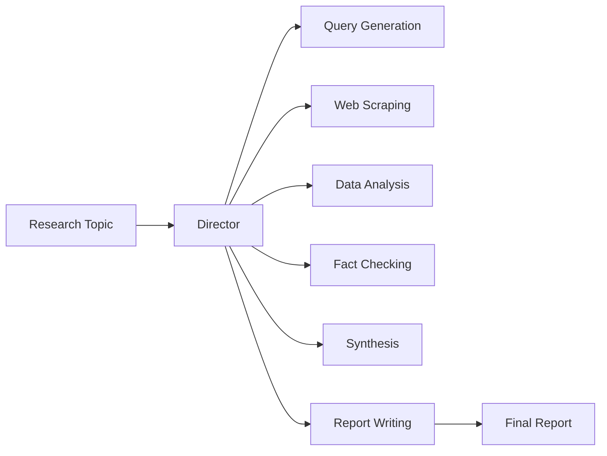

# Product Context: Mastervolt Deep Research

## Why This Project Exists

Research is time-consuming and often requires expertise across multiple domains. Mastervolt Deep Research automates the research process by orchestrating specialized AI agents that each excel at specific tasks—from query generation to fact-checking to final report writing.

## Problems It Solves

### 1. Research Fragmentation

**Problem**: Manual research requires switching between tools, sources, and formats.
**Solution**: Unified multi-agent system that handles the entire research pipeline.

### 2. Verification Burden

**Problem**: Fact-checking claims across multiple sources is tedious.
**Solution**: Automated fact-checker agent with confidence scoring and bias detection.

### 3. Synthesis Complexity

**Problem**: Combining insights from diverse sources while maintaining accuracy.
**Solution**: Synthesizer agent that resolves contradictions and creates unified narratives.

### 4. Report Quality

**Problem**: Producing publication-ready reports with proper citations.
**Solution**: Writer agent trained for PhD-level academic writing with citation management.

## User Experience Goals

### For Researchers

- Submit a topic, receive a comprehensive research report
- Track progress through VoltOps dashboard
- Access intermediate results from each agent

### For Developers

- Extend with custom agents and tools
- Configure workflow chains
- Monitor via OpenTelemetry traces

### For Organizations

- Consistent research quality
- Auditable agent decisions
- Scalable infrastructure

## Target Users

1. **Academic Researchers** - Literature reviews, citation management
2. **Market Analysts** - Competitive intelligence, trend analysis
3. **Journalists** - Investigative research, fact verification
4. **Technical Writers** - Documentation generation
5. **Due Diligence Teams** - Company research, risk assessment

## Key Workflows

---

*Last Updated: 2025-11-27
