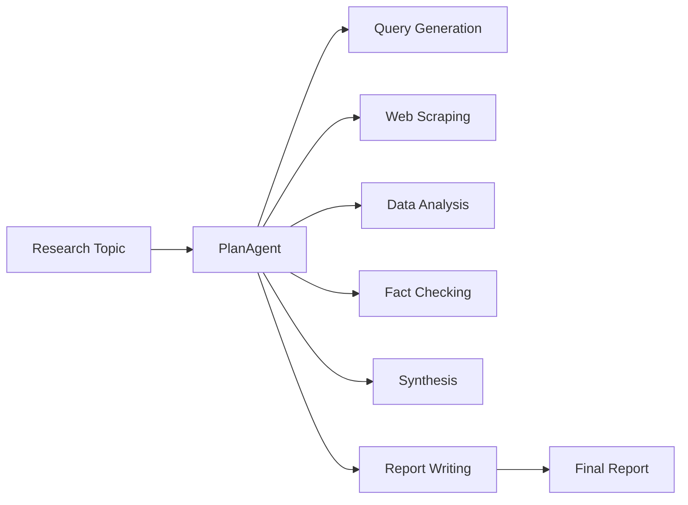

# Product Context: Mastervolt Deep Research

## Why This Project Exists

Research is time-consuming and often requires expertise across multiple domains. Mastervolt Deep Research automates the research process by orchestrating 14+ specialized AI agents that each excel at specific tasks—from query generation and web scraping to fact-checking, data analysis, and final report writing.

## Problems It Solves

### 1. Research Fragmentation

**Problem**: Manual research requires switching between tools, sources, and formats.
**Solution**: Unified multi-agent system that handles the entire research pipeline with 14 specialized agents.

### 2. Data Collection

**Problem**: Gathering data from web, PDFs, APIs is complex and error-prone.
**Solution**: Custom web scraper, PDF toolkit (text, metadata, OCR), ArXiv integration, GitHub toolkit, and financial data APIs (stocks, crypto - no API key required).

### 3. Verification Burden

**Problem**: Fact-checking claims across multiple sources is tedious.
**Solution**: Automated fact-checker agent with confidence scoring, bias detection, and credibility scoring.

### 4. Synthesis Complexity

**Problem**: Combining insights from diverse sources while maintaining accuracy.
**Solution**: Synthesizer agent that resolves contradictions, identifies gaps, and creates unified narratives.

### 5. Report Quality

**Problem**: Producing publication-ready reports with proper citations.
**Solution**: Writer agent trained for PhD-level academic writing with citation management.

### 6. Security Concerns

**Problem**: Enterprise deployments need input/output filtering.
**Solution**: VoltAgent v2 guardrails - PII redaction, profanity filter, prompt injection detection, sensitive data masking.

## User Experience Goals

### For Researchers

- Submit a topic, receive a comprehensive research report
- Track progress through VoltOps dashboard
- Access intermediate results from each agent
- Use academic tools (ArXiv search, PDF extraction)

### For Developers

- Extend with custom agents and toolkits
- Configure workflow chains
- Monitor via OpenTelemetry traces
- Use built-in security guardrails

### For Organizations

- Consistent research quality with audit trails
- Security guardrails for enterprise compliance
- Scalable infrastructure with LibSQL memory

## Target Users

1. **Academic Researchers** - Literature reviews, citation management, ArXiv integration
2. **Market Analysts** - Stock/crypto data, competitive intelligence, trend analysis
3. **Journalists** - Investigative research, fact verification, bias detection
4. **Technical Writers** - Documentation generation, code analysis
5. **Due Diligence Teams** - Company research, risk assessment
6. **Developers** - Code implementation, testing, code review agents

## Key Workflows

### Available Agents (14+)

| Agent                | Purpose                            |
| -------------------- | ---------------------------------- |
| PlanAgent            | Main orchestrator (100 max steps)  |
| Assistant            | Query generation                   |
| Writer               | Report composition                 |
| Data Analyzer        | Pattern detection                  |
| Data Scientist       | Statistical analysis, EDA          |
| Fact Checker         | Claim verification, bias detection |
| Synthesizer          | Information synthesis              |
| Scrapper             | Web scraping                       |
| Coding               | Code implementation                |
| Code Reviewer        | Code quality auditing              |
| Content Curator      | Content ranking                    |
| Research Coordinator | Task planning                      |
| Judge                | Quality evaluation                 |
| Support              | User support                       |

### Available Toolkits (28+)

- Web Scraper Toolkit
- ArXiv Toolkit
- Stock Market Toolkit (Yahoo, Stooq)
- Crypto Market Toolkit (Binance, DexScreener)
- Alpha Vantage Toolkit
- Financial Analysis Toolkit
- Statistical Analysis Toolkit
- PDF Toolkit (text, metadata, OCR)
- GitHub Toolkit
- RAG Toolkit
- Knowledge Graph Toolkit
- Data Processing Toolkit
- Code Analysis Toolkit
- Visualization Toolkit
- And more...

---

\*Last Updated: 2026-02-14
