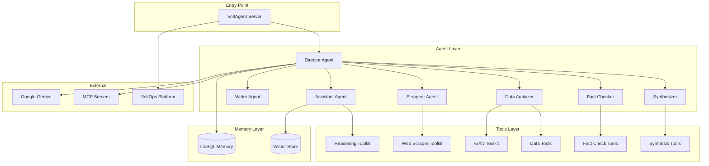

# System Patterns: Mastervolt Deep Research

## Architecture Overview



## Design Patterns

### 1. Supervisor-Worker Pattern

The Director agent supervises all other agents, routing tasks and aggregating results.

```typescript
// Director with sub-agents
new Agent({
  id: "director",
  subAgents: [assistant, writer, analyzer, checker, synthesizer, scrapper],
  // ...
})
```

### 2. Frontend Animation Orchestration (New)

Synchronizing smooth scrolling with complex animations using GSAP and Lenis.

```typescript
// Pattern: Lenis + GSAP Sync in SmoothScroll.tsx
const lenis = new Lenis({...});
lenis.on("scroll", ScrollTrigger.update);
gsap.ticker.add((time) => lenis.raf(time * 1000));
```

### 3. Interactive UI Primitives

Encapsulating interactive behaviors into reusable hooks.

```typescript
// Pattern: useMagnetic for interactive elements
const ref = useMagnetic(strength);
// Uses gsap.quickTo for high-performance position updates
```

### 4. Workflow Chain Pattern

Type-safe workflow composition with Zod schemas:

```typescript
createWorkflowChain({
  input: z.object({ topic: z.string() }),
  result: z.object({ text: z.string() }),
})
  .andThen({ id: "step1", execute: async ({ data }) => {...} })
  .andThen({ id: "step2", execute: async ({ data, getStepData }) => {...} })
```

### 3. Toolkit Pattern

Group related tools into toolkits for agent consumption:

```typescript
export const webScraperToolkit = [
  scrapeWebpageMarkdownTool,
  extractCodeBlocksTool,
  extractStructuredDataTool,
  extractTextContentTool,
  batchScrapePagesTool,
]
```

### 4. Memory Scoping Pattern

User-scoped working memory with Zod schema validation:

```typescript
workingMemory: {
  enabled: true,
  scope: "user",
  schema: z.object({
    profile: z.object({ name: z.string().optional() }),
    preferences: z.array(z.string()).optional(),
  }),
}
```

## Component Relationships

| Component | Depends On | Used By |
| --- | --- | --- |
| Director | All agents, Reasoning | VoltAgent |
| Assistant | Reasoning, Debug | Director |
| Writer | Memory | Director |
| Data Analyzer | ArXiv, DataTools | Director |
| Fact Checker | FactTools, Reasoning | Director |
| Synthesizer | SynthTools, Reasoning | Director |
| Scrapper | WebScraper, Filesystem | Director |

## Key Technical Decisions

### 1. VoltAgent Framework

**Decision**: Use VoltAgent for multi-agent orchestration.
**Rationale**: TypeScript-native, built-in workflow chains, VoltOps integration.

### 2. Google Gemini (Primary Model)

**Decision**: Use Gemini 2.5 Flash as the primary LLM.
**Rationale**: Fast, cost-effective, good reasoning for research tasks.

### 3. LibSQL for Memory

**Decision**: Use LibSQL (SQLite-based) for agent memory.
**Rationale**: Local persistence, vector search support, no external DB needed.

### 4. Zod Validation

**Decision**: Validate all inputs/outputs with Zod schemas.
**Rationale**: Type safety, runtime validation, self-documenting APIs.

### 5. Tool-First Design

**Decision**: Give agents specialized tools rather than general capabilities.
**Rationale**: More control, better observability, easier testing.

## Error Handling

1. **Tool Failures**: Graceful degradation with retry logic
2. **Agent Timeouts**: Max steps limit (25) prevents infinite loops
3. **Memory Errors**: Fallback to in-memory caching
4. **External API Failures**: Rate limiting and circuit breakers

---

*Last Updated: 2026-01-21
