# System Patterns: Mastervolt Deep Research

## Architecture Overview

```mermaid
flowchart TB
    subgraph "Entry Point"
        VoltAgent[VoltAgent Server]
    end

    subgraph "Agent Layer (14+ Agents)"
        Plan[Plan Agent]
        Assistant[Assistant Agent]
        Writer[Writer Agent]
        Analyzer[Data Analyzer]
        Checker[Fact Checker]
        Synth[Synthesizer]
        Scrapper[Scrapper Agent]
        Coding[Coding Agent]
        DataScientist[Data Scientist]
        Judge[Judge Agent]
        ContentCurator[Content Curator]
        ResearchCoord[Research Coordinator]
        Director[Director Agent]
        CodeReviewer[Code Reviewer]
        Support[Support Agent]
    end

    subgraph "Tools Layer (28+ Toolkits)"
        Reasoning[Reasoning Toolkit]
        WebScraper[Web Scraper Toolkit]
        ArXiv[ArXiv Toolkit]
        DataTools[Data Processing]
        FactTools[Fact Check Tools]
        SynthTools[Synthesis Tools]
        Stock[Stock Market Toolkit]
        Crypto[Crypto Market Toolkit]
        AlphaVantage[Alpha Vantage]
        Financial[Financial Analysis]
        CodeAnalysis[Code Analysis]
        Git[Git Toolkit]
        GitHub[GitHub Toolkit]
        Test[Test Toolkit]
        RAG[RAG Toolkit]
        KnowledgeGraph[Knowledge Graph]
        PDF[PDF Toolkit]
        Visualization[Visualization]
        Weather[Weather Toolkit]
    end

    subgraph "Memory Layer"
        LibSQL[(LibSQL Memory)]
        Vector[(Vector Store)]
    end

    subgraph "External"
        Gemini[Google Gemini]
        MCP[MCP Servers]
        VoltOps[VoltOps Platform]
        OpenAI[OpenAI]
    end

    VoltAgent --> Plan
    Plan --> Assistant & Writer & Analyzer & Checker & Synth & Scrapper & Coding & DataScientist

    Assistant --> Reasoning
    Analyzer --> ArXiv & DataTools
    Checker --> FactTools
    Synth --> SynthTools
    Scrapper --> WebScraper
    Coding --> CodeAnalysis & Git & Test

    Plan --> LibSQL
    Assistant --> Vector

    Plan --> Gemini
    Plan --> MCP
    VoltAgent --> VoltOps
```



## Design Patterns

### 1. Supervisor-Worker Pattern

The Plan Agent supervises all other agents, routing tasks and aggregating results.

```typescript
// PlanAgent with sub-agents
new Agent({
    id: 'plan',
    name: 'Plan Agent',
    subAgents: [
        assistant,
        writer,
        analyzer,
        checker,
        synthesizer,
        scrapper,
        coding,
        dataScientist,
    ],
})
```

### 2. Guardrails Pattern (New)

Input/output validation using VoltAgent built-in guardrails:

```typescript
import {
    createDefaultInputSafetyGuardrails,
    createDefaultPIIGuardrails,
} from '@voltagent/core'

const guardrails = createDefaultInputSafetyGuardrails()
const piiGuardrails = createDefaultPIIGuardrails()

new Agent({
    id: 'plan',
    inputGuardrails: [guardrails, piiGuardrails],
})
```

### 3. Workflow Chain Pattern

Type-safe workflow composition with Zod schemas:

```typescript
createWorkflowChain({
  input: z.object({ topic: z.string() }),
  result: z.object({ text: z.string() }),
})
  .andThen({ id: "step1", execute: async ({ data }) => {...} })
  .andThen({ id: "step2", execute: async ({ data, getStepData }) => {...} })
```

### 4. Toolkit Pattern

Group related tools into toolkits:

```typescript
export const webScraperToolkit = [
    scrapeWebpageMarkdownTool,
    extractCodeBlocksTool,
    extractStructuredDataTool,
]

export const stockMarketToolkit = [
    getStockQuoteTool,
    getStockHistoryTool,
    searchStocksTool,
]
```

### 5. Memory Scoping Pattern

User-scoped working memory with Zod schema validation:

```typescript
workingMemory: {
  enabled: true,
  scope: "user",
  schema: z.object({
    profile: z.object({ name: z.string().optional() }),
    preferences: z.array(z.string()).optional(),
  }),
}
```

## Component Relationships

| Component      | Depends On            | Used By   |
| -------------- | --------------------- | --------- |
| Plan Agent     | All agents, Reasoning | VoltAgent |
| Assistant      | Reasoning, Debug      | Plan      |
| Writer         | Memory                | Plan      |
| Data Analyzer  | ArXiv, DataTools      | Plan      |
| Fact Checker   | FactTools             | Plan      |
| Synthesizer    | SynthTools            | Plan      |
| Scrapper       | WebScraper            | Plan      |
| Coding         | CodeAnalysis, Git     | Plan      |
| Data Scientist | DataProcessing        | Plan      |

## Key Technical Decisions

1. **VoltAgent Framework** - TypeScript-native, workflow chains, VoltOps, guardrails
2. **Google Gemini** - Primary LLM (gemini-2.5-flash-lite)
3. **LibSQL** - Local memory + vector storage
4. **Zod Validation** - Runtime type safety
5. **Tool-First Design** - Specialized tools over general capabilities
6. **Guardrails** - PII, safety, input validation

---

_Last Updated: 2026-02-14_
