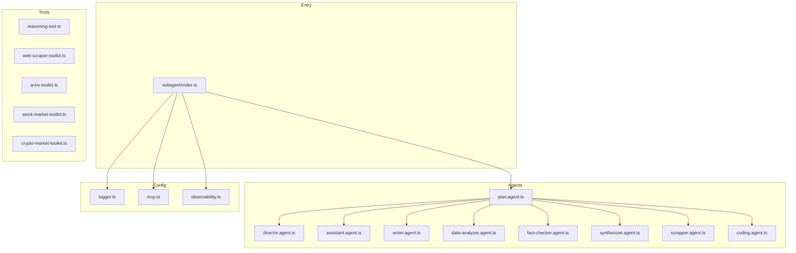

# Tech Context: Mastervolt Deep Research

## Technology Stack

### Core Framework

| Technology     | Version | Purpose                   |
| -------------- | ------- | ------------------------- |
| VoltAgent Core | ^2.4.1  | Multi-agent orchestration |
| TypeScript     | 5.9.3   | Type-safe language        |
| Node.js        | 18+     | Runtime environment       |
| AI SDK         | ^6.0.86 | Multi-model abstraction   |

### AI Providers

| Provider  | Package                | Models                     |
| --------- | ---------------------- | -------------------------- |
| Google AI | @ai-sdk/google ^3.0.10 | Gemini 2.5 Flash (primary) |
| OpenAI    | @ai-sdk/openai ^3.0.12 | GPT-5 (optional)           |
| Vertex AI | @ai-sdk/google-vertex  | Vertex models              |

### Storage & Memory

| Technology | Package                  | Purpose                 |
| ---------- | ------------------------ | ----------------------- |
| LibSQL     | @voltagent/libsql ^2.0.2 | Memory & vector storage |
| Supabase   | @supabase/supabase-js    | A2A task storage        |

### Observability

| Technology        | Package         | Purpose                |
| ----------------- | --------------- | ---------------------- |
| OpenTelemetry SDK | ^0.210.0        | Tracing infrastructure |
| VoltOps           | @voltagent/core | Platform sync          |

### Web Scraping

| Technology | Package | Purpose          |
| ---------- | ------- | ---------------- |
| Cheerio    | ^1.1.2  | HTML parsing     |
| JSDOM      | ^27.4.0 | DOM simulation   |
| Turndown   | ^7.2.2  | HTML to Markdown |

### Data Processing

| Technology      | Package | Purpose           |
| --------------- | ------- | ----------------- |
| Zod             | ^4.1.13 | Schema validation |
| fast-xml-parser | ^5.3.3  | XML parsing       |
| pdf-parse       | ^2.4.5  | PDF extraction    |

### Testing

| Technology          | Package | Purpose        |
| ------------------- | ------- | -------------- |
| Vitest              | ^4.0.18 | Test framework |
| @vitest/coverage-v8 | ^4.0.14 | Coverage       |

## Development Setup

### Prerequisites

```bash
node -v  # >= 18.0.0
npm -v   # >= 9.0.0
```

### Environment Variables

```bash
# Required
GOOGLE_GENERATIVE_AI_API_KEY=your_key

# Optional
VOLTAGENT_PUBLIC_KEY=your_key
VOLTAGENT_SECRET_KEY=your_key
SUPABASE_URL=your_url
SUPABASE_KEY=your_key
EXA_API_KEY=your_key
ALPHA_VANTAGE_API_KEY=your_key
```

### Commands

```bash
npm run dev       # Development with watch mode (VoltAgent)
npm run dev:next  # Next.js dev server
npm run dev:test  # Run both concurrently
npm run build     # TypeScript compilation
npm start         # Production server
npm test          # Run tests
npm run lint      # ESLint check
```

## Technical Constraints

### Memory Limits

- `maxHistoryEntries`: 100 per agent
- `maxSteps`: 100 for PlanAgent, 25 for others
- `maxOutputTokens`: 64000 (model dependent)

### API Rate Limits

- Google AI: Standard rate limits apply
- VoltOps: 50% sampling ratio
- Batch export: 512 events, 4-second intervals

### File Paths

- Memory DB: `.voltagent/{agent-id}-memory.db`
- Vector store: `.voltagent/memory.db`
- Traces: `.voltagent/observability.db`
- Build output: `dist/`

## Dependencies Graph



---

\*Last Updated: 2026-02-14
