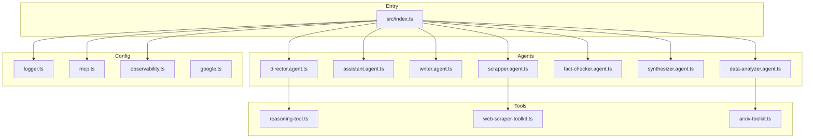

# Tech Context: Mastervolt Deep Research

## Technology Stack

### Core Framework

| Technology | Version | Purpose |
|-----------|---------|---------|
| VoltAgent Core | 1.2.10 | Multi-agent orchestration |
| TypeScript | 5.9.3 | Type-safe language |
| Node.js | 18+ | Runtime environment |
| AI SDK | 5.0.103 | Multi-model abstraction |

### AI Providers

| Provider | Package | Models |
|----------|---------|--------|
| Google AI | @ai-sdk/google ^2.0.43 | Gemini 2.5 Flash (primary) |
| OpenAI | @ai-sdk/openai ^2.0.73 | GPT-4o (optional) |
| Vertex AI | @ai-sdk/google-vertex ^3.0.80 | Vertex models |
| OpenRouter | @openrouter/ai-sdk-provider ^1.2.7 | Multi-model routing |

### Storage & Memory

| Technology | Package | Purpose |
|-----------|---------|---------|
| LibSQL | @voltagent/libsql ^1.0.12 | Memory & vector storage |
| Supabase | @supabase/supabase-js ^2.86.0 | A2A task storage |

### Observability

| Technology | Package | Purpose |
|-----------|---------|---------|
| OpenTelemetry SDK | ^0.207.0 | Tracing infrastructure |
| VoltOps | @voltagent/core | Platform sync |
| Langfuse | @voltagent/langfuse-exporter ^1.1.3 | Optional exporter |

### Web Scraping

| Technology | Package | Purpose |
|-----------|---------|---------|
| Cheerio | ^1.1.2 | HTML parsing |
| JSDOM | ^27.2.0 | DOM simulation |
| Turndown | ^7.2.2 | HTML to Markdown |
| Playwright | ^1.57.0 | Browser automation |
| Crawlee | ^3.15.3 | Crawling framework |

### Data Processing

| Technology | Package | Purpose |
|-----------|---------|---------|
| Zod | ^4.1.13 | Schema validation |
| fast-xml-parser | ^5.3.2 | XML parsing |
| convert-csv-to-json | ^3.18.0 | Data conversion |
| pdf-parse | ^2.4.5 | PDF extraction |
| marked | ^16.4.2 | Markdown parsing |

### Testing

| Technology | Package | Purpose |
|-----------|---------|---------|
| Vitest | ^4.0.14 | Test framework |
| @vitest/coverage-v8 | ^4.0.14 | Coverage |
| viteval | ^0.5.6 | Evaluation framework |

## Development Setup

### Prerequisites

```bash
node -v  # >= 18.0.0
npm -v   # >= 9.0.0
```

### Environment Variables

```bash
# Required
GOOGLE_GENERATIVE_AI_API_KEY=your_key
VOLTAGENT_PUBLIC_KEY=your_key
VOLTAGENT_SECRET_KEY=your_key

# Optional
SUPABASE_URL=your_url
SUPABASE_KEY=your_key
EXA_API_KEY=your_key
HUGGING_FACE_TOKEN=your_token
OPENAI_API_KEY=your_key
```

### Commands

```bash
npm run dev    # Development with watch mode
npm run build  # TypeScript compilation
npm start      # Production server
npm test       # Run tests
npm run eval   # Run evaluations
npm run lint   # ESLint check
```

## Technical Constraints

### Memory Limits

- `maxHistoryEntries`: 100 per agent
- `maxSteps`: 25 per request (prevents infinite loops)
- `maxOutputTokens`: 64000 (model dependent)

### API Rate Limits

- Google AI: Standard rate limits apply
- VoltOps: 50% sampling ratio
- Batch export: 512 events, 4-second intervals

### File Paths

- Memory DB: `.voltagent/{agent-id}-memory.db`
- Vector store: `.voltagent/memory.db`
- Traces: `.voltagent/observability.db`
- Build output: `dist/`

## Dependencies Graph



---

*Last Updated: 2025-11-27
